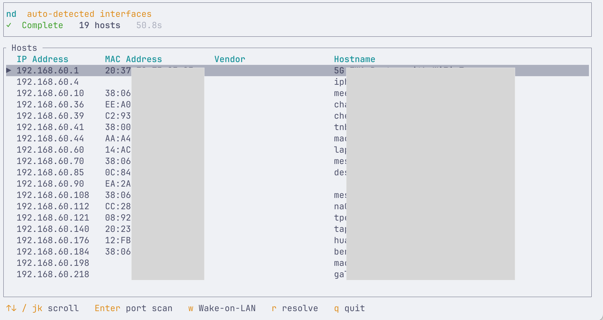
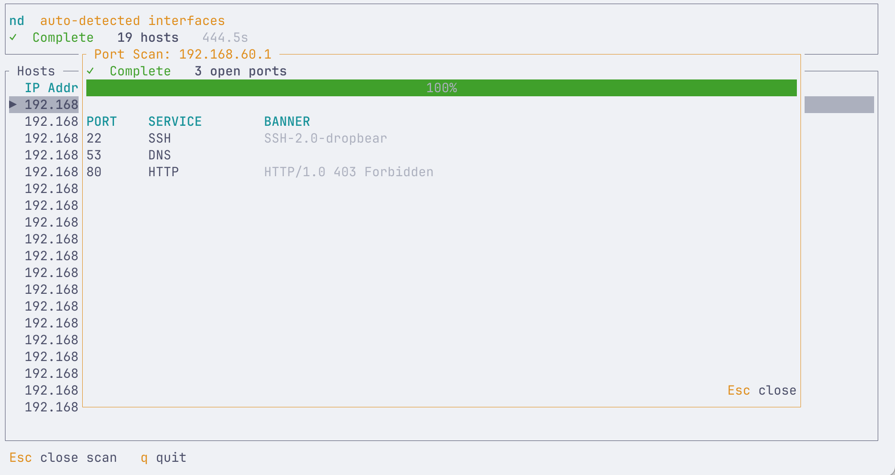
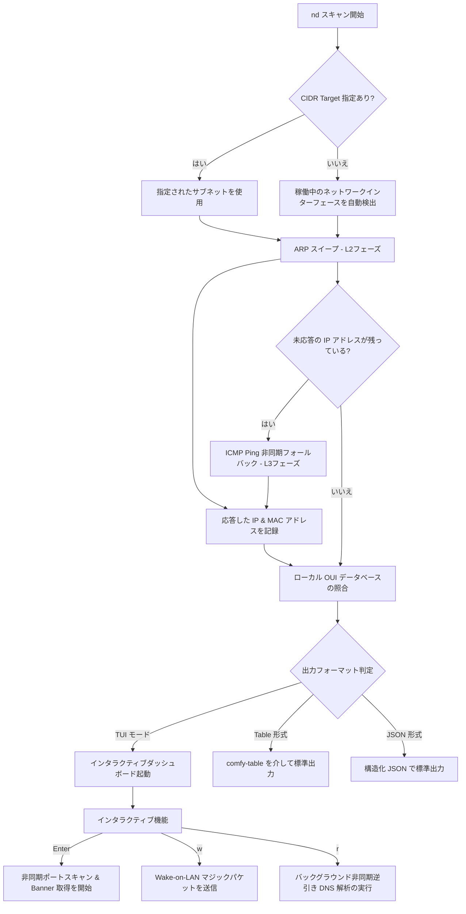

# 🌐 Network Discover (nd)

[](https://www.rust-lang.org/)
[](LICENSE)
[](#)

> [!NOTE]
> **Languages**
> * [English (Default)](README.md)
> * [繁體中文 (Traditional Chinese)](README.zh-TW.md)

`network-discover`（ターミナルコマンド名は `nd`）は、Rustで開発された**極めて高速で軽量なローカルエリアネットワーク (LAN) ホスト検出・管理用 CLI ツール**です。高度に効率化された ARP スキャンと ICMP フォールバックプロブを組み合わせ、機能豊富な端末ユーザーインターフェース (TUI)、非同期ポートスキャン、高度なサービス Banner 取得、および Wake-on-LAN (WOL) 機能を統合し、ネットワーク管理者やセキュリティの専門家へリアルタイムで明瞭な LAN デバイスマップ提供します。

---

## ✨ 機能特徴

*   **⚡ 高速デュアルスキャンエンジン**
    *   **ARP スイープ（最優先）**: レイヤー2（データリンク層）で直接ブロードキャストし、極めて高速かつ正確にアクティブホストの MAC アドレスと IP を紐づけて検出します。
    *   **ICMP Ping フォールバック**: ARP に応答しないホストや異なるセグメントのホストに対して、自動的に非同期 ICMP プロブを実行し、稼働中のデバイスを漏らさず検出します。
*   **💻 美しい全画面 TUI インタラクティブダッシュボード**
    *   `ratatui` と `crossterm` を採用し、レスポンスが良く洗練された配色で視認性の高い UI を提供します。
    *   検出されたホスト数、経過時間、リアルタイムのスキャン進捗率を流れるように動的描画します。

    

*   **🔍 ポートスキャンとサービス Banner の取得**
    *   TUI 画面上でホストを選択し `Enter` を押すだけで、100以上の一般的なポートに対して**非同期並行ポートスキャン**を起動。
    *   **インテリジェントな Banner 解析**:
        *   SSH、FTP、SMTP、IMAP などのテキストプロトコルでは、接続直後に返る初期挨拶語（Greeting banner）を自動収集。
        *   HTTP（80, 8080, 3000 等）に対しては自動的に `HEAD` リクエストを送り、レスポンスから `Server` ヘッダーを解析。
        *   Redis（6379）に対しては `PING` コマンドを送信して応答を解析。

    
*   **⚡ 非同期 Wake-on-LAN (WOL)**
    *   TUI 上のホスト、または手動で入力した MAC アドレスに向けて、IEEE 802.3 規格に準拠したマジックパケットを簡単に送信可能。
*   **🏢 100% オフラインでの MAC ベンダー名特定 (OUI)**
    *   MAC アドレス登録機関 (OUI) データベースをバイナリ内部にコンパイル時に組み込み。外部ネットワークに接続せず完全にオフライン環境でも、即座に製造元（Apple、Raspberry Pi、Intel、Synology など）を特定できます。
*   **🔄 ローカルサービスのアクティブ検出 (mDNS & SSDP)**
    *   バックグラウンドで UDP マルチキャストおよびユニキャストを介して、アクティブなサービス（Apple AirPlay、ワークステーション、Google Cast、UPnP など）を自動検出します。無機質な IP/MAC アドレスを、人間にとって分かりやすいデバイスの別名（例: `"Sonos Play:1"`、`"Apple TV 4K"`）に置き換えます。
*   **⏱️ リアルタイムネットワーク遅延の動的表示 (Ping RTT) [オプション]**
    *   `--show-latency` オプションを指定して起動すると、TUI テーブル内に **"Latency"** 列が動的に挿入され、バックグラウンドで軽量な ICMP ping を定期的に全ホストへ送信してリアルタイムで応答速度（ミリ秒）を更新します。
*   **📊 多彩な出力フォーマット**
    *   `tui`（標準）：動的な全画面インタラクティブダッシュボード。
    *   `table`：整形された表形式で標準出力へ出力。
    *   `json`：構造化 JSON データ（`--show-latency` 併用時は `rtt_ms` フィールドも自動出力）。

---

## 🛠️ 技術アーキテクチャとスキャンフロー

各コンポーネントはモジュール化され、非常にシンプルに設計されています：
*   `arp.rs` & `icmp.rs`: レイヤー2およびレイヤー3の高速スキャンコア。
*   `portscan.rs` & `banner.rs`: 非同期での TCP スキャンとサービス識別。
*   `oui.rs`: 完全オフラインの OUI 製造元照会。
*   `tui.rs`: UI レンダリングおよびイベントループ。

全体フローは以下の通りです：



---

## 📥 インストールと環境準備

このツールは低レイヤーの Raw ソケット送受信を行うため、以下のシステム準備が必要です。

### 1. システム依存関係 (Linux のみ)

Linux ユーザーは、`libpcap` の開発者向けパッケージをインストールする必要があります：
```bash
# Ubuntu / Debian
sudo apt-get install libpcap-dev

# CentOS / RHEL
sudo yum install libpcap-devel
```

### 2. コンパイル

リポジトリをクローンし、Cargo でリリースビルドを実行します：
```bash
cargo build --release
```
ビルドされたバイナリは `target/release/network-discover` に出力されます。

### 🔑 権限要件について

ARP および Raw ICMP パケットの構築には Raw ソケット送信権限が必要です：
1.  **root または sudo で実行する**（最もシンプル）：
    ```bash
    sudo target/release/network-discover [オプション]
    ```
2.  **Linux ケーパビリティの付与**（推奨。sudo なしで一般ユーザーから実行可能）：
    生成されたバイナリに `cap_net_raw` ケーパビリティを付与します：
    ```bash
    sudo setcap cap_net_raw+ep target/release/network-discover
    ```
    付与後は、通常のユーザー権限で直接起動できます：
    ```bash
    ./target/release/network-discover
    ```

---

## 🚀 使用方法

### 1. コマンドラインオプション

ヘルプ引数 `-h` または `--help` を付けて起動すると、最新のパラメーターを確認できます：

```text
nd - Discover live hosts on your local network

Usage: nd [OPTIONS]

Options:
      --target <CIDR>      スキャン対象 of サブネット (例 192.168.1.0/24)。省略時は稼働中のローカルインターフェースを自動検出
      --output <FORMAT>    出力形式: tui (標準), table, json
      --resolve            起動時に自動的に逆引き DNS 解析を実行 (非 TUI モード時)
      --concurrency <N>    最大並行プロブ数 [標準: 256]
      --show-latency       リアルタイム遅延 (Ping RTT) 測定を有効化 (TUI/JSON モードのみサポート)
  -h, --help               ヘルプメッセージの表示
  -V, --version            バージョン情報の表示
```

> [!WARNING]
> **安全性制限**: 設定ミスによる大規模ネットワークへの過度な輻輳やフリーズを避けるため、`network-discover` は** /16 より大きい（広い）サブネットのスキャンを自動的に拒否**します。

### 2. コマンド実行例

*   **デフォルトの TUI ダッシュボードで現在の LAN をスキャン**:
    ```bash
    sudo ./target/release/network-discover
    ```
*   **指定したサブネットをスキャンし、表形式で標準出力に出力**:
    ```bash
    sudo ./target/release/network-discover --target 192.168.50.0/24 --output table
    ```
*   **ホスト名を逆引きしつつ、結果を JSON ファイルにエクスポート**:
    ```bash
    sudo ./target/release/network-discover --target 10.0.0.0/24 --output json --resolve > lan_hosts.json
    ```
*   **TUI 上でリアルタイムネットワーク遅延（レイテンシ）表示を有効にして起動**:
    ```bash
    sudo ./target/release/network-discover --show-latency
    ```

---

## ⌨️ TUI 操作ショートカットキー

`tui` モードで起動した際、キーボード操作で以下のようにダッシュボードを操作できます：

| キー | アクション | 説明 |
| :--- | :--- | :--- |
| **`↑ / ↓`** or **`j / k`** | **移動 / スクロール** | 検出された稼働中ホスト一覧を上下に移動し、ターゲットを選択。 |
| **`Enter`** | **ポートスキャンの起動/閉じる** | 選択中のホストに対して非同期 TCP ポートスキャンを起動。サイドパネルにスキャン進捗、オープンポート、取得できた Banner 情報が**リアルタイムで動的にレンダリング**されます。もう一度押すか `Esc` を押すと閉じます。 |
| **`w`** | **Wake-on-LAN** | ネットワーク起動ダイアログを開きます。選択中ホストの MAC アドレスが既知の場合は自動で入力されます。`Enter` を押すとマジックパケットを送信します。 |
| **`r`** | **ホスト名逆引きの実行** | スキャン完了後、このキーを押すとバックグラウンドで全ホストに対する逆引き DNS 解決を行い、ダッシュボード上に反映します。 |
| **`Esc`** | **ダイアログを閉じる** | アクティブなポートスキャン画面や WOL 入力欄を閉じ、メインリストに戻ります。 |
| **`q`** | **終了** | アプリケーションを終了し、正常にターミナル設定を復元して終了します。 |

---

## 📂 ディレクトリ構造

```text
network-discover/
├── assets/
│   └── oui.txt             # MAC 組織登録機関 (OUI) データベースファイル (コンパイル時に組み込み)
├── src/
│   ├── main.rs             # CLI エントリーポイント。スキャンループと ICMP フォールバックの制御
│   ├── types.rs            # データモデル定義 (HostInfo, HostInfoJson)
│   ├── discovery.rs        # mDNS & SSDP によるローカルサービスのアクティブ検出と名前解決
│   ├── interface.rs        # ローカルネットワークインターフェース一覧およびサブネットの検出
│   ├── arp.rs              # ARP リクエスト送信およびキャプチャの制御
│   ├── icmp.rs             # surge-ping を使用した ICMP ピン送信 (フォールバック)
│   ├── oui.rs              # オフライン OUI データベース照合
│   ├── tui.rs              # 全画面ダッシュボード描画およびイベントループ
│   ├── portscan.rs         # 非同期並行 TCP ポートスキャナー
│   ├── banner.rs           # インテリジェントな TCP サービス Banner 取得エンジン
│   ├── wol.rs              # Wake-on-LAN マジックパケットブロードキャスター
│   └── output.rs           # 標準出力フォーマッター (table, json)
├── Cargo.toml              # パッケージ情報および依存パッケージ管理
└── CLAUDE.md               # 開発ガイドライン、CLI 設計ルール
```

---

## 🔒 License

本プロジェクトは **MIT ライセンス** の下で公開されています。商用・非商用問わず、自由に変更・配布・再利用いただけます。
