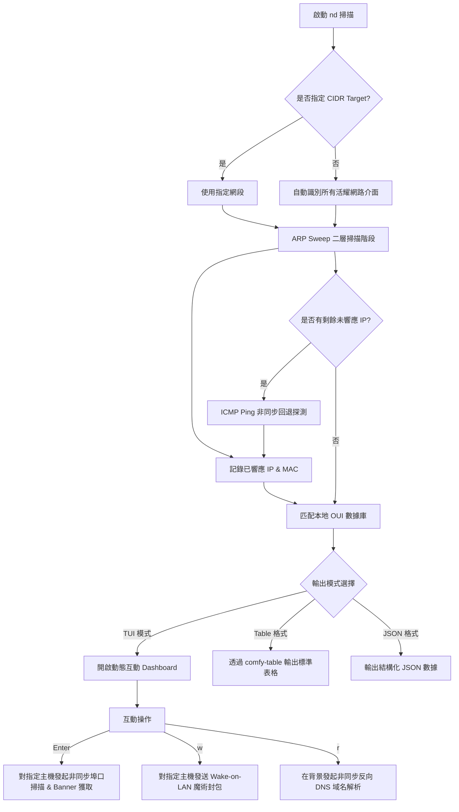
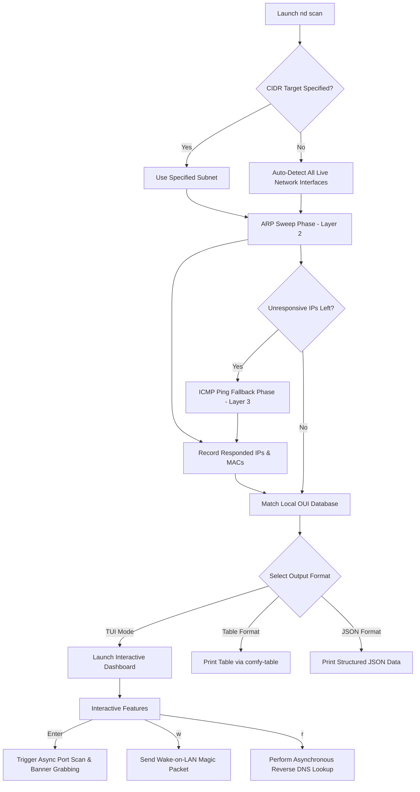

# 🌐 Network Discover (nd)

[](https://www.rust-lang.org/)
[](LICENSE)
[](#)

> [!NOTE]
> **語言 / Languages**
> * [繁體中文 (Traditional Chinese)](#-繁體中文)
> * [English](#-english)
> * [日本語 (Japanese)](#-日本語)

---

## 繁體中文

`network-discover`（終端命令為 `nd`）是一個基於 Rust 開發的**極速、輕量級區域網路 (LAN) 主機探測與管理 CLI 工具**。它結合了高效的 ARP 掃描與 ICMP 回退探測，並整合了強大的 TUI 互動式介面、非同步埠口掃描、服務 Banner 識別以及網路喚醒 (Wake-on-LAN) 功能，旨在為網路系統管理員與安全人員提供一目了然的局域網設備視圖。

### ✨ 功能特點

*   **⚡ 雙模組局域網高速掃描**
    *   **首選 ARP 掃描**：直接在二層（Data Link Layer）廣播，探測速度極快且精確，能直接獲取活耀主機的 MAC 地址。
    *   **ICMP Ping 回退機制**：針對未響應 ARP 的主機或跨網段設備，自動發起非同步 ICMP 探測，確保不漏掉任何一台設備。
*   **💻 強大的全螢幕 TUI 互動面板**
    *   基於 `ratatui` 與 `crossterm` 開發，介面精美、色彩和諧、響應流暢。
    *   支持實時動態數據流式渲染，掃描進度、耗時與發現設備數一目了然。
*   **🔍 互動式埠口掃描與服務 Banner 抓取**
    *   在 TUI 模式下，選中主機按下 `Enter` 即可發起**非同步並行埠口掃描**（內建 100+ 常見服務埠口）。
    *   **智慧型服務 Banner 解析**：
        *   對 SSH、FTP 等協議，自動擷取初始招呼語（Greeting）。
        *   對 HTTP 服務（80、8080、3000 等），自動發送 `HEAD` 請求並解析 `Server` 響應頭。
        *   對 Redis（6379），自動發送 `PING` 進行主動探測。
*   **⚡ 非同步 Wake-on-LAN (WOL)**
    *   TUI 模式下，選中主機或手動輸入 MAC 地址後，一鍵發送 IEEE 802.3 標準的網路喚醒魔術封包（Magic Packet）。
*   **🏢 100% 離線 MAC 製造商識別 (OUI)**
    *   本地內置完整的 MAC 組織唯一識別碼數據庫，在沒有外網連接的離線狀態下，仍能瞬間解析設備製造商（如 Apple、Raspberry Pi、Intel、Synology 等）。
*   **🔄 可選非同步域名解析**
    *   支援對掃描出來的 IP 進行反向 DNS（Reverse DNS）解析，快速識別局域網設備名稱。
*   **📊 多元化輸出格式**
    *   `tui`（預設）：豐富流暢的互動式終端介面。
    *   `table`：乾淨漂亮的格式化表格，直接輸出至終端。
    *   `json`：標準、結構化的 JSON 格式，便於腳本自動化處理或與其他工具 pipeline 整合。

### 🛠️ 技術架構與掃描流程

`network-discover` 的底層模組化設計十分清晰，主要模組包含：
*   `arp.rs` & `icmp.rs`：負責二層與三層網路的探測核心邏輯。
*   `portscan.rs` & `banner.rs`：負責非同步 TCP 埠口探測與特徵碼抓取。
*   `oui.rs`：MAC 廠商離線數據匹配。
*   `tui.rs`：終端 UI 渲染與事件環（Event Loop）調度。

以下為整體工作流程與架構圖：



### 📥 安裝與環境準備

由於本工具涉及底層封包的構建與發送，對權限與環境有一定要求。

#### 1. 系統依賴 (僅 Linux 需要)

Linux 用戶需要安裝編譯基本依賴（libpcap 相關開發庫，視發行版而定）：
```bash
# Ubuntu / Debian
sudo apt-get install libpcap-dev

# CentOS / RHEL
sudo yum install libpcap-devel
```

#### 2. 編譯專案

克隆倉庫後，在專案根目錄下使用 Cargo 進行編譯：
```bash
cargo build --release
```
編譯完成後，可執行檔將位於 `target/release/network-discover`。

#### 🔑 權限要求說明

因為 ARP 與 Raw ICMP 封包需要底層 Raw Socket 權限：
1.  **直接以 root 運行** (最簡單)：
    ```bash
    sudo target/release/network-discover [選項]
    ```
2.  **Linux 特權授權** (推薦，無需 root 執行)：
    如果您不想每次都使用 `sudo`，可以為編譯出的二進位檔案授予 `cap_net_raw` 權限：
    ```bash
    sudo setcap cap_net_raw+ep target/release/network-discover
    ```
    之後便可以直接非 root 執行：
    ```bash
    ./target/release/network-discover
    ```

### 🚀 使用指南

#### 1. 命令行選項與說明

你可以直接運行帶有 `-h` 或 `--help` 的命令來查看最新參數：

```text
nd - Discover live hosts on your local network

Usage: nd [OPTIONS]

Options:
      --target <CIDR>      要掃描的子網段 (例如 192.168.1.0/24)。如果不指定，nd 會自動偵測所有活耀網卡介面進行掃描
      --output <FORMAT>    輸出格式: tui (預設), table, json
      --resolve            在啟動時自動進行反向 DNS 主機名稱解析 (若在非 TUI 模式下)
      --concurrency <N>    最大並行探測數 [預設: 256]
  -h, --help               顯示幫助資訊
  -V, --version            顯示版本資訊
```

> [!WARNING]
> **安全保護限制**：為了防止由於配置失誤而導致整個大型網段崩潰或系統卡死，`network-discover` 會主動**拒絕掃描大於 /16 的網段**。

#### 2. 實用指令示例

*   **以預設的互動式 TUI 介面掃描當前區域網路**：
    ```bash
    sudo ./target/release/network-discover
    ```
*   **指定掃描特定網段並直接輸出 Table 表格至終端**：
    ```bash
    sudo ./target/release/network-discover --target 192.168.50.0/24 --output table
    ```
*   **輸出 JSON 格式並啟用反向 DNS 解析（便於二次腳本解析）**：
    ```bash
    sudo ./target/release/network-discover --target 10.0.0.0/24 --output json --resolve > lan_hosts.json
    ```

### ⌨️ TUI 互動操作捷徑

當你以預設的 `tui` 模式啟動時，終端將展現一個色彩分明的高畫質操作面板。你可透過鍵盤進行以下控制：

| 快捷鍵 | 功能動作 | 說明 |
| :--- | :--- | :--- |
| **`↑ / ↓`** 或 **`j / k`** | **瀏覽滾動** | 在發現 of 存活主機列表中上下移動游標，選中目標設備。 |
| **`Enter`** | **開啟/關閉埠口掃描** | 對目前選中的主機發起非同步 TCP 常見埠口掃描，並在側邊面板**實時動態展示**掃描進度、開放埠口、對應服務名稱與抓取到的 Banner 特徵碼。 |
| **`w`** | **Wake-on-LAN 網路喚醒** | 開啟 WOL 對話框。若當前選中的主機有已知的 MAC 地址，會自動填入，按下 `Enter` 即可發射魔術封包。 |
| **`r`** | **手動觸發域名解析** | 在初始掃描完成後，按下此鍵可背景非同步為所有已發現的 IP 進行反向 DNS 解析，並將主機名稱填入表格。 |
| **`Esc`** | **關閉彈窗** | 關閉埠口掃描面板或 WOL 輸入對話框，回到主列表視圖。 |
| **`q`** | **退出** | 關閉應用程式並安全釋放終端資源。 |

---

## English

`network-discover` (aliased as `nd` in terminal) is a **blazing-fast, lightweight Local Area Network (LAN) host discovery and management CLI tool** written in Rust. By combining highly efficient ARP scanning with ICMP fallback probing, it features a comprehensive terminal user interface (TUI), asynchronous port scanning, intelligent service banner grabbing, and Wake-on-LAN (WOL) capabilities, designed to provide system administrators and security professionals with a clear, real-time view of local network devices.

### ✨ Features

*   **⚡ High-Speed Dual-Scan Engine**
    *   **ARP Sweeping (Primary)**: Broadcasts directly at Layer 2 (Data Link Layer). It is exceptionally fast and directly resolves live hosts' MAC addresses.
    *   **ICMP Ping Fallback**: Automatically falls back to concurrent ICMP pinging for hosts that do not respond to ARP or are outside the local segment, ensuring no active host is missed.
*   **💻 Rich Full-Screen TUI Dashboard**
    *   Powered by `ratatui` and `crossterm` for a responsive, clean, and harmoniously color-coded interface.
    *   Streams live scanning progress, host count, and elapsed time dynamically.
*   **🔍 Interactive Port Scanning & Service Banner Grabbing**
    *   Press `Enter` on any host in the TUI to launch a **fully asynchronous parallel port scan** against 100+ well-known and registered ports.
    *   **Intelligent Banner Probing**:
        *   Retrieves standard greeting banners on connect for protocols like SSH, FTP, SMTP, POP3, etc.
        *   Sends HTTP `HEAD` requests to ports like 80, 8080, 3000 to extract the `Server` header value.
        *   Sends Redis `PING` command on port 6379 to actively probe status.
*   **⚡ Asynchronous Wake-on-LAN (WOL)**
    *   Send standard IEEE 802.3 Wake-on-LAN Magic Packets to target devices with a single keypress.
*   **🏢 100% Offline MAC Vendor Lookup (OUI)**
    *   Bundles a MAC OUI database into the binary at compile time. Instantly translates MAC addresses to manufacturer names (e.g., Apple, Raspberry Pi, Intel, Synology) without any internet connection at runtime.
*   **🔄 Reverse DNS Hostname Resolution**
    *   Resolves local IP addresses to hostnames concurrently on demand using asynchronous reverse DNS lookups.
*   **📊 Versatile Output Formats**
    *   `tui` (Default): Interactive full-screen terminal experience.
    *   `table`: Clean, human-readable table printed via `comfy-table` to standard output.
    *   `json`: Structured JSON format, ideal for scripts, piping, or automation workflows.

### 🛠️ Architecture & Scan Workflow

The modular design of `network-discover` keeps components highly focused:
*   `arp.rs` & `icmp.rs`: Layer 2 and Layer 3 discovery engines.
*   `portscan.rs` & `banner.rs`: Asynchronous TCP port prober and application banner parser.
*   `oui.rs`: Offline MAC address to vendor matching.
*   `tui.rs`: UI rendering and event loop management.

The workflow is illustrated below:



### 📥 Installation & Setup

Since this tool utilizes low-level raw socket operations, it requires specific environment configurations.

#### 1. System Dependencies (Linux Only)

Linux users need to install the development libraries for `libpcap`:
```bash
# Ubuntu / Debian
sudo apt-get install libpcap-dev

# CentOS / RHEL
sudo yum install libpcap-devel
```

#### 2. Building the Project

Clone the repository and compile it using Cargo:
```bash
cargo build --release
```
The compiled binary will be placed at `target/release/network-discover`.

#### 🔑 Privilege Requirements

Because ARP and Raw ICMP packets require Raw Socket permissions:
1.  **Run with root/sudo** (Simplest):
    ```bash
    sudo target/release/network-discover [OPTIONS]
    ```
2.  **Grant Linux Capabilities** (Recommended, allows execution without root):
    You can grant the `cap_net_raw` capability to the compiled binary:
    ```bash
    sudo setcap cap_net_raw+ep target/release/network-discover
    ```
    Once granted, execute it as a regular user:
    ```bash
    ./target/release/network-discover
    ```

### 🚀 Usage Guide

#### 1. Command-Line Options

Run the binary with `-h` or `--help` to view all available parameters:

```text
nd - Discover live hosts on your local network

Usage: nd [OPTIONS]

Options:
      --target <CIDR>      The subnet to scan (e.g., 192.168.1.0/24). If omitted, nd auto-detects active local interfaces
      --output <FORMAT>    Output format: tui (default), table, json
      --resolve            Perform reverse DNS lookup automatically (in non-TUI modes)
      --concurrency <N>    Maximum number of concurrent probes [default: 256]
  -h, --help               Print help information
  -V, --version            Print version information
```

> [!WARNING]
> **Safety Constraint**: To prevent accidental congestion or performance freezes from oversized subnet configurations, `network-discover` **actively refuses to scan subnets larger than /16**.

#### 2. Example Commands

*   **Scan current LAN with the default interactive TUI dashboard**:
    ```bash
    sudo ./target/release/network-discover
    ```
*   **Scan a specific subnet and print a formatted table directly to stdout**:
    ```bash
    sudo ./target/release/network-discover --target 192.168.50.0/24 --output table
    ```
*   **Export scan results to a JSON file while resolving hostnames**:
    ```bash
    sudo ./target/release/network-discover --target 10.0.0.0/24 --output json --resolve > lan_hosts.json
    ```

### ⌨️ TUI Keyboard Shortcuts

When running in `tui` mode, you can control the dynamic dashboard with the following hotkeys:

| Key | Action | Description |
| :--- | :--- | :--- |
| **`↑ / ↓`** or **`j / k`** | **Navigate / Scroll** | Navigate up and down through the list of discovered live hosts. |
| **`Enter`** | **Port Scan / Close** | Trigger an asynchronous TCP port scan on the selected host. Dynamic scan progress, open ports, and banners will render in the side panel in real-time. Press again or press `Esc` to close. |
| **`w`** | **Wake-on-LAN** | Open the Wake-on-LAN input dialog. If the selected host has a known MAC address, it is autofilled. Press `Enter` to send the magic packet. |
| **`r`** | **Resolve Hostnames** | Perform background reverse DNS queries on all discovered hosts on demand once the initial sweep is complete. |
| **`Esc`** | **Close Panel** | Close the active port scan sidebar or the WOL dialog to return to the host list. |
| **`q`** | **Quit** | Exit the application and cleanly restore terminal settings. |

---

## 日本語

`network-discover`（ターミナルコマンド名は `nd`）は、Rustで開発された**極めて高速で軽量なローカルエリアネットワーク (LAN) ホスト検出・管理用 CLI ツール**です。高度に効率化された ARP スキャンと ICMP フォールバックプロブを組み合わせ、機能豊富な端末ユーザーインターフェース (TUI)、非同期ポートスキャン、高度なサービス Banner 取得、および Wake-on-LAN (WOL) 機能を統合し、ネットワーク管理者やセキュリティの専門家へリアルタイムで明瞭な LAN デバイスマップを提供します。

### ✨ 機能特徴

*   **⚡ 高速デュアルスキャンエンジン**
    *   **ARP スイープ（最優先）**: レイヤー2（データリンク層）で直接ブロードキャストし、極めて高速かつ正確にアクティブホストの MAC アドレスと IP を紐づけて検出します。
    *   **ICMP Ping フォールバック**: ARP に応答しないホストや異なるセグメントのホストに対して、自動的に非同期 ICMP プロブを実行し、稼働中のデバイスを漏らさず検出します。
*   **💻 美しい全画面 TUI インタラクティブダッシュボード**
    *   `ratatui` と `crossterm` を採用し、レスポンスが良く洗練された配色で視認性の高い UI を提供します。
    *   検出されたホスト数、経過時間、リアルタイムのスキャン進捗率を流れるように動的描画します。
*   **🔍 ポートスキャンとサービス Banner の取得**
    *   TUI 画面上でホストを選択し `Enter` を押すだけで、100以上の一般的なポートに対して**非同期並行ポートスキャン**を起動。
    *   **インテリジェントな Banner 解析**:
        *   SSH、FTP、SMTP、IMAP などのテキストプロトコルでは、接続直後に返る初期挨拶語（Greeting banner）を自動収集。
        *   HTTP（80, 8080, 3000 等）に対しては自動的に `HEAD` リクエストを送り、レスポンスから `Server` ヘッダーを解析。
        *   Redis（6379）に対しては `PING` コマンドを送信して応答を解析。
*   **⚡ 非同期 Wake-on-LAN (WOL)**
    *   TUI 上のホスト、または手動で入力した MAC アドレスに向けて、IEEE 802.3 規格に準拠したマジックパケットを簡単に送信可能。
*   **🏢 100% オフラインでの MAC ベンダー名特定 (OUI)**
    *   MAC アドレス登録機関 (OUI) データベースをバイナリ内部にコンパイル時に組み込み。外部ネットワークに接続せず完全にオフライン環境でも、即座に製造元（Apple、Raspberry Pi、Intel、Synology など）を特定できます。
*   **🔄 非同期逆引き DNS 解析**
    *   スキャンされた IP に対応するホスト名をバックグラウンド非同期処理で解決し、ダッシュボードへ動的反映します。
*   **📊 多彩な出力フォーマット**
    *   `tui`（標準）：動的な全画面インタラクティブダッシュボード。
    *   `table`：整形された表形式で標準出力へ出力。
    *   `json`：スクリプト処理や他のツールとの連携が容易な、整形済みの構造化 JSON データ。

### 🛠️ 技術アーキテクチャとスキャンフロー

各コンポーネントはモジュール化され、非常にシンプルに設計されています：
*   `arp.rs` & `icmp.rs`: レイヤー2およびレイヤー3の高速スキャンコア。
*   `portscan.rs` & `banner.rs`: 非同期での TCP スキャンとサービス識別。
*   `oui.rs`: 完全オフラインの OUI 製造元照会。
*   `tui.rs`: UI レンダリングおよびイベントマネージャー。

全体フローは以下の通りです：


### 📥 インストールと環境準備

このツールは低レイヤーの Raw ソケット送受信を行うため、以下のシステム準備が必要です。

#### 1. システム依存関係 (Linux のみ)

Linux ユーザーは、`libpcap` の開発者向けパッケージをインストールする必要があります：
```bash
# Ubuntu / Debian
sudo apt-get install libpcap-dev

# CentOS / RHEL
sudo yum install libpcap-devel
```

#### 2. コンパイル

リポジトリをクローンし、Cargo でリリースビルドを実行します：
```bash
cargo build --release
```
ビルドされたバイナリは `target/release/network-discover` に出力されます。

#### 🔑 権限要件について

ARP および Raw ICMP パケットの構築には Raw ソケット送信権限が必要です：
1.  **root または sudo で実行する**（最もシンプル）：
    ```bash
    sudo target/release/network-discover [オプション]
    ```
2.  **Linux ケーパビリティの付与**（推奨。sudo なしで一般ユーザーから実行可能）：
    生成されたバイナリに `cap_net_raw` ケーパビリティを付与します：
    ```bash
    sudo setcap cap_net_raw+ep target/release/network-discover
    ```
    付与後は、通常のユーザー権限で直接起動できます：
    ```bash
    ./target/release/network-discover
    ```

### 🚀 使用方法

#### 1. コマンドラインオプション

ヘルプ引数 `-h` または `--help` を付けて起動すると、最新のパラメーターを確認できます：

```text
nd - Discover live hosts on your local network

Usage: nd [OPTIONS]

Options:
      --target <CIDR>      スキャン対象のサブネット (例 192.168.1.0/24)。省略時は稼働中のローカルインターフェースを自動検出
      --output <FORMAT>    出力形式: tui (標準), table, json
      --resolve            起動時に自動的に逆引き DNS 解析を実行 (非 TUI モード時)
      --concurrency <N>    最大並行プロブ数 [標準: 256]
  -h, --help               ヘルプメッセージの表示
  -V, --version            バージョン情報の表示
```

> [!WARNING]
> **安全性制限**: 設定ミスによる大規模ネットワークへの過度な輻輳やフリーズを避けるため、`network-discover` は** /16 より大きい（広い）サブネットのスキャンを自動的に拒否**します。

#### 2. コマンド実行例

*   **デフォルトの TUI ダッシュボードで現在の LAN をスキャン**:
    ```bash
    sudo ./target/release/network-discover
    ```
*   **指定したサブネットをスキャンし、表形式で標準出力に出力**:
    ```bash
    sudo ./target/release/network-discover --target 192.168.50.0/24 --output table
    ```
*   **ホスト名を逆引きしつつ、結果を JSON ファイルにエクスポート**:
    ```bash
    sudo ./target/release/network-discover --target 10.0.0.0/24 --output json --resolve > lan_hosts.json
    ```

### ⌨️ TUI 操作ショートカットキー

`tui` モードで起動した際、キーボード操作で以下のようにダッシュボードを操作できます：

| キー | アクション | 説明 |
| :--- | :--- | :--- |
| **`↑ / ↓`** または **`j / k`** | **移動 / スクロール** | 検出された稼働中ホスト一覧を上下に移動し、ターゲットを選択。 |
| **`Enter`** | **ポートスキャンの起動/閉じる** | 選択中のホストに対して非同期 TCP ポートスキャンを起動。サイドパネルにスキャン進捗、オープンポート、取得できた Banner 情報が**リアルタイムで動的にレンダリング**されます。もう一度押すか `Esc` を押すと閉じます。 |
| **`w`** | **Wake-on-LAN** | ネットワーク起動ダイアログを開きます。選択中ホストの MAC アドレスが既知の場合は自動で入力されます。`Enter` を押すとマジックパケットを送信します。 |
| **`r`** | **ホスト名逆引きの実行** | スキャン完了後、このキーを押すとバックグラウンドで全ホストに対する逆引き DNS 解決を行い、ダッシュボード上に反映します。 |
| **`Esc`** | **ダイアログを閉じる** | アクティブなポートスキャン画面や WOL 入力欄を閉じ、メインリストに戻ります。 |
| **`q`** | **終了** | アプリケーションを終了し、正常にターミナル設定を復元して終了します。 |

---

## 📂 Directory Structure

```text
network-discover/
├── assets/
│   └── oui.txt             # MAC 組織登録機関 (OUI) データベースファイル (コンパイル時に組み込み)
├── src/
│   ├── main.rs             # CLI エントリーポイント。スキャンループと ICMP フォールバックの制御
│   ├── types.rs            # データモデル定義 (HostInfo, HostInfoJson)
│   ├── interface.rs        # ローカルネットワークインターフェース一覧およびサブネットの検出
│   ├── arp.rs              # ARP リクエスト送信およびキャプチャの制御
│   ├── icmp.rs             # surge-ping を使用した ICMP ピン送信 (フォールバック)
│   ├── oui.rs              # オフライン OUI データベース照合
│   ├── tui.rs              # 全画面ダッシュボード描画およびイベントループ
│   ├── portscan.rs         # 非同期並行 TCP ポートスキャナー
│   ├── banner.rs           # インテリジェントな TCP サービス Banner 取得エンジン
│   ├── wol.rs              # Wake-on-LAN マジックパケットブロードキャスター
│   └── output.rs           # 標準出力フォーマッター (table, json)
├── Cargo.toml              # パッケージ情報および依存パッケージ管理
└── CLAUDE.md               # 開発ガイドライン、CLI 設計ルール
```

---

## 🔒 License

本プロジェクトは **MIT ライセンス** の下で公開されています。商用・非商用問わず、自由に変更・配布・再利用いただけます。
