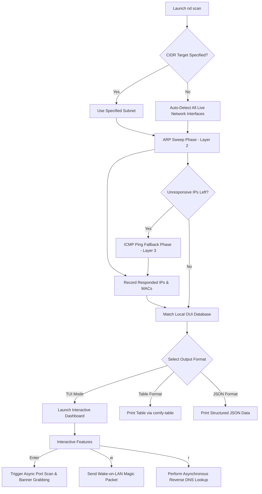

# 🌐 Network Discover (nd)

[](https://www.rust-lang.org/)
[](LICENSE)
[](#)

> [!NOTE]
> **Languages**
> * [繁體中文 (Traditional Chinese)](README.zh-TW.md)
> * [日本語 (Japanese)](README.ja.md)

`network-discover` (aliased as `nd` in terminal) is a **blazing-fast, lightweight Local Area Network (LAN) host discovery and management CLI tool** written in Rust. By combining highly efficient ARP scanning with ICMP fallback probing, it features a comprehensive terminal user interface (TUI), asynchronous port scanning, intelligent service banner grabbing, and Wake-on-LAN (WOL) capabilities, designed to provide system administrators and security professionals with a clear, real-time view of local network devices.

---

## ✨ Features

*   **⚡ High-Speed Dual-Scan Engine**
    *   **ARP Sweeping (Primary)**: Broadcasts directly at Layer 2 (Data Link Layer). It is exceptionally fast and directly resolves live hosts' MAC addresses.
    *   **ICMP Ping Fallback**: Automatically falls back to concurrent ICMP pinging for hosts that do not respond to ARP or are outside the local segment, ensuring no active host is missed.
*   **💻 Rich Full-Screen TUI Dashboard**
    *   Powered by `ratatui` and `crossterm` for a responsive, clean, and harmoniously color-coded interface.
    *   Streams live scanning progress, host count, and elapsed time dynamically.

    

*   **🔍 Interactive Port Scanning & Service Banner Grabbing**
    *   Press `Enter` on any host in the TUI to launch a **fully asynchronous parallel port scan** against 100+ well-known and registered ports.
    *   **Intelligent Banner Probing**:
        *   Retrieves standard greeting banners on connect for protocols like SSH, FTP, SMTP, POP3, etc.
        *   Sends HTTP `HEAD` requests to ports like 80, 8080, 3000 to extract the `Server` header value.
        *   Sends Redis `PING` command on port 6379 to actively probe status.

    
*   **⚡ Asynchronous Wake-on-LAN (WOL)**
    *   Send standard IEEE 802.3 Wake-on-LAN Magic Packets to target devices with a single keypress.
*   **🏢 100% Offline MAC Vendor Lookup (OUI)**
    *   Bundles a MAC OUI database into the binary at compile time. Instantly translates MAC addresses to manufacturer names (e.g., Apple, Raspberry Pi, Intel, Synology) without any internet connection at runtime.
*   **🔄 Active Local Service Discovery (mDNS & SSDP)**
    *   Automatically probes active services (like Apple AirPlay, Workstations, Google Cast, and UPnP) via UDP multicast and unicast in the background. It replaces cryptic IP/MAC addresses with friendly device names (e.g., `"Sonos Play:1"`, `"Apple TV 4K"`).
*   **⏱️ Optional Real-time Latency Monitoring (Ping RTT)**
    *   Pass the `--show-latency` option to dynamically display a **"Latency"** column in the TUI table and periodically poll all active hosts in the background using lightweight ICMP pings.
*   **📊 Versatile Output Formats**
    *   `tui` (Default): Interactive full-screen terminal experience.
    *   `table`: Clean, human-readable table printed via `comfy-table` to standard output.
    *   `json`: Structured JSON format (supports `rtt_ms` when `--show-latency` is enabled).

---

## 🛠️ Architecture & Scan Workflow

The modular design of `network-discover` keeps components highly focused:
*   `arp.rs` & `icmp.rs`: Layer 2 and Layer 3 discovery engines.
*   `portscan.rs` & `banner.rs`: Asynchronous TCP port prober and application banner parser.
*   `oui.rs`: Offline MAC address to vendor matching.
*   `tui.rs`: UI rendering and event loop management.

The workflow is illustrated below:



---

## 📥 Installation & Setup

Since this tool utilizes low-level raw socket operations, it requires specific environment configurations.

### 1. System Dependencies (Linux Only)

Linux users need to install the development libraries for `libpcap`:
```bash
# Ubuntu / Debian
sudo apt-get install libpcap-dev

# CentOS / RHEL
sudo yum install libpcap-devel
```

### 2. Building the Project

Clone the repository and compile it using Cargo:
```bash
cargo build --release
```
The compiled binary will be placed at `target/release/network-discover`.

### 🔑 Privilege Requirements

Because ARP and Raw ICMP packets require Raw Socket permissions:
1.  **Run with root/sudo** (Simplest):
    ```bash
    sudo target/release/network-discover [OPTIONS]
    ```
2.  **Grant Linux Capabilities** (Recommended, allows execution without root):
    You can grant the `cap_net_raw` capability to the compiled binary:
    ```bash
    sudo setcap cap_net_raw+ep target/release/network-discover
    ```
    Once granted, execute it as a regular user:
    ```bash
    ./target/release/network-discover
    ```

---

## 🚀 Usage Guide

### 1. Command-Line Options

Run the binary with `-h` or `--help` to view all available parameters:

```text
nd - Discover live hosts on your local network

Usage: nd [OPTIONS]

Options:
      --target <CIDR>      The subnet to scan (e.g., 192.168.1.0/24). If omitted, nd auto-detects active local interfaces
      --output <FORMAT>    Output format: tui (default), table, json
      --resolve            Perform reverse DNS lookup automatically (in non-TUI modes)
      --concurrency <N>    Maximum number of concurrent probes [default: 256]
      --show-latency       Enable real-time network latency (Ping RTT) polling in TUI/JSON modes
  -h, --help               Print help information
  -V, --version            Print version information
```

> [!WARNING]
> **Safety Constraint**: To prevent accidental congestion or performance freezes from oversized subnet configurations, `network-discover` **actively refuses to scan subnets larger than /16**.

### 2. Example Commands

*   **Scan current LAN with the default interactive TUI dashboard**:
    ```bash
    sudo ./target/release/network-discover
    ```
*   **Scan a specific subnet and print a formatted table directly to stdout**:
    ```bash
    sudo ./target/release/network-discover --target 192.168.50.0/24 --output table
    ```
*   **Export scan results to a JSON file while resolving hostnames**:
    ```bash
    sudo ./target/release/network-discover --target 10.0.0.0/24 --output json --resolve > lan_hosts.json
    ```
*   **Scan current LAN with latency polling enabled in the TUI**:
    ```bash
    sudo ./target/release/network-discover --show-latency
    ```

---

## ⌨️ TUI Keyboard Shortcuts

When running in `tui` mode, you can control the dynamic dashboard with the following hotkeys:

| Key | Action | Description |
| :--- | :--- | :--- |
| **`↑ / ↓`** | **Navigate / Scroll** | Navigate up and down through the list of discovered live hosts. |
| **`Enter`** | **Port Scan / Close** | Trigger an asynchronous TCP port scan on the selected host. Dynamic scan progress, open ports, and banners will render in the side panel in real-time. Press again or press `Esc` to close. |
| **`w`** | **Wake-on-LAN** | Open the Wake-on-LAN input dialog. If the selected host has a known MAC address, it is autofilled. Press `Enter` to send the magic packet. |
| **`r`** | **Resolve Hostnames** | Perform background reverse DNS queries on all discovered hosts on demand once the initial sweep is complete. |
| **`Esc`** | **Close Panel** | Close the active port scan sidebar or the WOL dialog to return to the host list. |
| **`q`** | **Quit** | Exit the application and cleanly restore terminal settings. |

---

## 📂 Directory Structure

```text
network-discover/
├── assets/
│   └── oui.txt             # MAC Organizationally Unique Identifier (OUI) database (compiled into binary)
├── src/
│   ├── main.rs             # CLI entrypoint, orchestrates scan loop and fallback logic
│   ├── types.rs            # Core models (HostInfo, HostInfoJson)
│   ├── discovery.rs        # Active mDNS & SSDP friendly name resolution
│   ├── interface.rs        # Local network interface listing and subnet detection
│   ├── arp.rs              # ARP broadcasting and capturing logic
│   ├── icmp.rs             # ICMP ping probing fallback via surge-ping
│   ├── oui.rs              # 100% offline MAC OUI vendor matching
│   ├── tui.rs              # Full-screen interactive dashboard renderer & event loop
│   ├── portscan.rs         # Concurrent asynchronous TCP port prober
│   ├── banner.rs           # Intelligent TCP service banner parser
│   ├── wol.rs              # Wake-on-LAN magic packet broadcaster
│   └── output.rs           # Standard output formatters (table, json)
├── Cargo.toml              # Rust crate dependencies and build configurations
└── CLAUDE.md               # Developer notes, workflow instructions, and CLI specifications
```

---

## 🔒 License

This project is licensed under the **MIT License**. Feel free to use, modify, and distribute it in both commercial and non-commercial environments.
