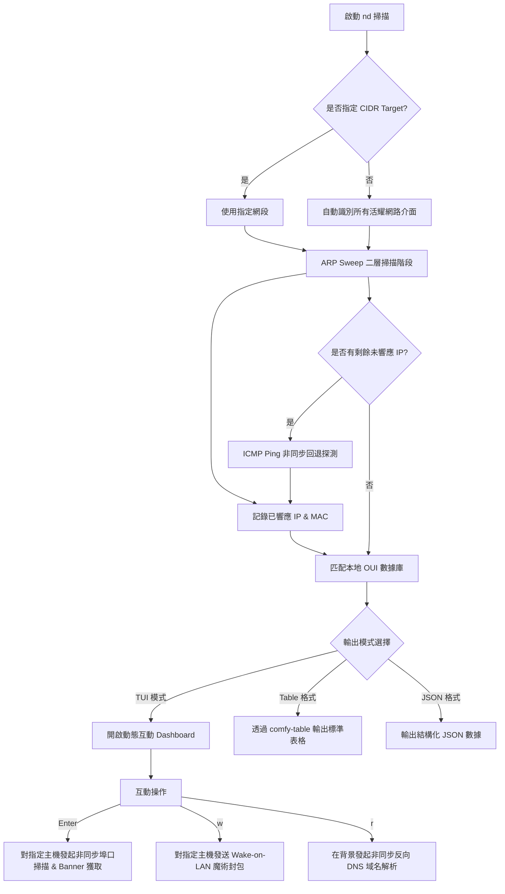

# 🌐 Network Discover (nd)

[](https://www.rust-lang.org/)
[](LICENSE)
[](#)

> [!NOTE]
> **語言 / Languages**
> * [English (Default)](README.md)
> * [日本語 (Japanese)](README.ja.md)

`network-discover`（終端命令為 `nd`）是一個基於 Rust 開發的**極速、輕量級區域網路 (LAN) 主機探測與管理 CLI 工具**。它結合了高效的 ARP 掃描與 ICMP 回退探測，並整合了強大的 TUI 互動式介面、非同步埠口掃描、服務 Banner 識別以及網路喚醒 (Wake-on-LAN) 功能，旨在為網路系統管理員與安全人員提供一目了然的局域網設備視圖。

---

## ✨ 功能特點

*   **⚡ 雙模組局域網高速掃描**
    *   **首選 ARP 掃描**：直接在二層（Data Link Layer）廣播，探測速度極快且精確，能直接獲取活耀主機的 MAC 地址。
    *   **ICMP Ping 回退機制**：針對未響應 ARP 的主機或跨網段設備，自動發起非同步 ICMP 探測，確保不漏掉任何一台設備。
*   **💻 強大的全螢幕 TUI 互動面板**
    *   基於 `ratatui` 與 `crossterm` 開發，介面精美、色彩和諧、響應流暢。
    *   支持實時動態數據流式渲染，掃描進度、耗時與發現設備數一目了然。
*   **🔍 互動式埠口掃描與服務 Banner 抓取**
    *   在 TUI 模式下，選中主機按下 `Enter` 即可發起**非同步並行埠口掃描**（內建 100+ 常見服務埠口）。
    *   **智慧型服務 Banner 解析**：
        *   對 SSH、FTP 等協議，自動擷取初始招呼語（Greeting）。
        *   對 HTTP 服務（80、8080、3000 等），自動發送 `HEAD` 請求並解析 `Server` 響應頭。
        *   對 Redis（6379），自動發送 `PING` 進行主動探測。
*   **⚡ 非同步 Wake-on-LAN (WOL)**
    *   TUI 模式下，選中主機或手動輸入 MAC 地址後，一鍵發送 IEEE 802.3 標準的網路喚醒魔術封包（Magic Packet）。
*   **🏢 100% 離線 MAC 製造商識別 (OUI)**
    *   本地內置完整的 MAC 組織唯一識別碼數據庫，在沒有外網連接的離線狀態下，仍能瞬間解析設備製造商（如 Apple、Raspberry Pi、Intel、Synology 等）。
*   **🔄 可選非同步域名解析**
    *   支援對掃描出來的 IP 進行反向 DNS（Reverse DNS）解析，快速識別局域網設備名稱。
*   **📊 多元化輸出格式**
    *   `tui`（預設）：豐富流暢的互動式終端介面。
    *   `table`：乾淨漂亮的格式化表格，直接輸出至終端。
    *   `json`：標準、結構化的 JSON 格式，便於腳本自動化處理或與其他工具 pipeline 整合。

---

## 🛠️ 技術架構與掃描流程

`network-discover` 的底層模組化設計十分清晰，主要模組包含：
*   `arp.rs` & `icmp.rs`：負責二層與三層網路的探測核心邏輯。
*   `portscan.rs` & `banner.rs`：負責非同步 TCP 埠口探測與特徵碼抓取。
*   `oui.rs`：MAC 廠商離線數據匹配。
*   `tui.rs`：終端 UI 渲染與事件環（Event Loop）調度。

以下為整體工作流程與架構圖：



---

## 📥 安裝與環境準備

由於本工具涉及底層封包的構建與發送，對權限與環境有一定要求。

### 1. 系統依賴 (僅 Linux 需要)

Linux 用戶需要安裝編譯基本依賴（libpcap 相關開發庫，視發行版而定）：
```bash
# Ubuntu / Debian
sudo apt-get install libpcap-dev

# CentOS / RHEL
sudo yum install libpcap-devel
```

### 2. 編譯專案

克隆倉庫後，在專案根目錄下使用 Cargo 進行編譯：
```bash
cargo build --release
```
編譯完成後，可執行檔將位於 `target/release/network-discover`。

### 🔑 權限要求說明

因為 ARP 與 Raw ICMP 封包需要底層 Raw Socket 權限：
1.  **直接以 root 運行** (最簡單)：
    ```bash
    sudo target/release/network-discover [選項]
    ```
2.  **Linux 特權授權** (推薦，無需 root 執行)：
    如果您不想每次都使用 `sudo`，可以為編譯出的二進位檔案授予 `cap_net_raw` 權限：
    ```bash
    sudo setcap cap_net_raw+ep target/release/network-discover
    ```
    之後便可以直接非 root 執行：
    ```bash
    ./target/release/network-discover
    ```

---

## 🚀 使用指南

### 1. 命令行選項與說明

你可以直接運行帶有 `-h` 或 `--help` 的命令來查看最新參數：

```text
nd - Discover live hosts on your local network

Usage: nd [OPTIONS]

Options:
      --target <CIDR>      要掃描的子網段 (例如 192.168.1.0/24)。如果不指定，nd 會自動偵測所有活耀網卡介面進行掃描
      --output <FORMAT>    輸出格式: tui (預設), table, json
      --resolve            在啟動時自動進行反向 DNS 主機名稱解析 (若在非 TUI 模式下)
      --concurrency <N>    最大並行探測數 [預設: 256]
  -h, --help               顯示幫助資訊
  -V, --version            顯示版本資訊
```

> [!WARNING]
> **安全保護限制**：為了防止由於配置失誤而導致整個大型網段崩潰或系統卡死，`network-discover` 會主動**拒絕掃描大於 /16 的網段**。

### 2. 實用指令示例

*   **以預設的互動式 TUI 介面掃描當前區域網路**：
    ```bash
    sudo ./target/release/network-discover
    ```
*   **指定掃描特定網段並直接輸出 Table 表格至終端**：
    ```bash
    sudo ./target/release/network-discover --target 192.168.50.0/24 --output table
    ```
*   **輸出 JSON 格式並啟用反向 DNS 解析（便於二次腳本解析）**：
    ```bash
    sudo ./target/release/network-discover --target 10.0.0.0/24 --output json --resolve > lan_hosts.json
    ```

---

## ⌨️ TUI 互動操作捷徑

當你以預設的 `tui` 模式啟動時，終端將展現一個色彩分明的高畫質操作面板。你可透過鍵盤進行以下控制：

| 快捷鍵 | 功能動作 | 說明 |
| :--- | :--- | :--- |
| **`↑ / ↓`** 或 **`j / k`** | **瀏覽滾動** | 在發現的存活主機列表中上下移動游標，選中目標設備。 |
| **`Enter`** | **開啟/關閉埠口掃描** | 對目前選中的主機發起非同步 TCP 常見埠口掃描，並在側邊面板**實時動態展示**掃描進度、開放埠口、對應服務名稱與抓取到的 Banner 特徵碼。 |
| **`w`** | **Wake-on-LAN 網路喚醒** | 開啟 WOL 對話框。若當前選中的主機有已知的 MAC 地址，會自動填入，按下 `Enter` 即可發射魔術封包。 |
| **`r`** | **手動觸發域名解析** | 在初始掃描完成後，按下此鍵可背景非同步為所有已發現的 IP 進行反向 DNS 解析，並將主機名稱填入表格。 |
| **`Esc`** | **關閉彈窗** | 關閉埠口掃描面板或 WOL 輸入對話框，回到主列表視圖。 |
| **`q`** | **退出** | 關閉應用程式並安全釋放終端資源。 |

---

## 📂 專案結構說明

```text
network-discover/
├── assets/
│   └── oui.txt             # MAC 組織唯一識別碼 (OUI) 本地數據庫檔案 (編譯時打包)
├── src/
│   ├── main.rs             # CLI 程式入口，管理掃描任務調度與回退邏輯
│   ├── types.rs            # 主機資訊結構體 (HostInfo, HostInfoJson) 定義
│   ├── interface.rs        # 本地網卡介面列舉與網段偵測
│   ├── arp.rs              # ARP 廣播探測與響應攔截
│   ├── icmp.rs             # 基於 surge-ping 的 ICMP 探測回退
│   ├── oui.rs              # 100% 離線 MAC 製造商比對邏輯
│   ├── tui.rs              # 主互動式 TUI (ratatui) 控制器與界面渲染
│   ├── portscan.rs         # 非同步並行多線程 TCP 埠口掃描
│   ├── banner.rs           # 智慧型 TCP 服務 Banner 特徵獲取
│   ├── wol.rs              # Wake-on-LAN 魔術封包發送模組
│   └── output.rs           # 靜態 Table 及 JSON 格式的 stdout 輸出格式化
├── Cargo.toml              # 專案依賴管理與 Rust 特性啟用
└── CLAUDE.md               # 開發者指南與 CLI 設計規範
```

---

## 🔒 授權條款

本專案採用 **MIT 授權條款** 進行開源。您可以自由下載、修改並將其應用於商業或非商業環境。
